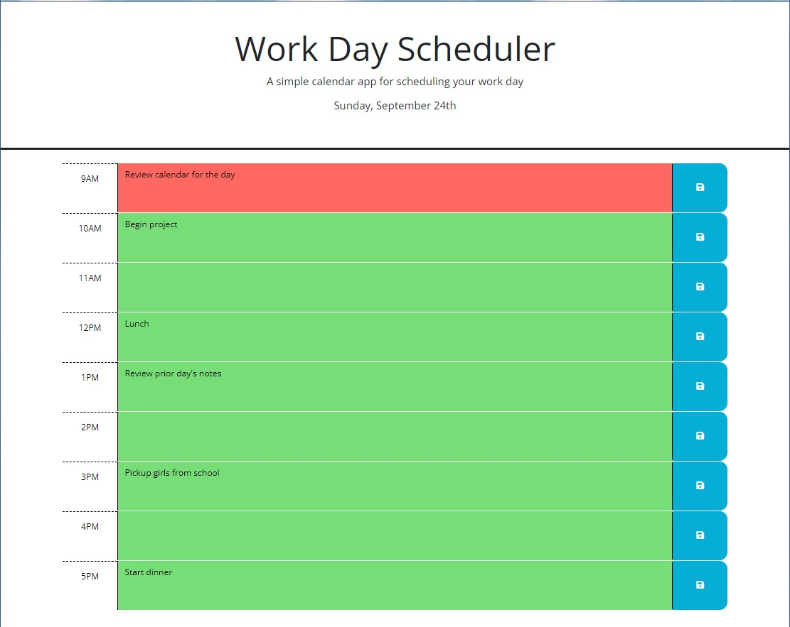

# WorkDayScheduler

## Description

This website allows a user to add important events to a daily planner so they can manage their time effectively.

This was accomplished by:

-setting up a daily planner to create a schedule for the day in hour blocks

-when the planner is opened, the current day is displayed at the top of the calendar

-when the user scrolls down, they are presented with time blocks for the standard business hours of 9AM throgh 5PM

-each time block is color coded to distinguish between past, present and future blocks

-when the user clicks in a block they can enter an event

-when the user clicks on the save button for the time block, the text for the event is saved in local storage

-when the page is refreshed, the saved events persist for that date

-when the date changes, events are cleared

## Usage

The deployed website can be found in the following location:

https://robertwright0830.github.io/WorkDayScheduler/

